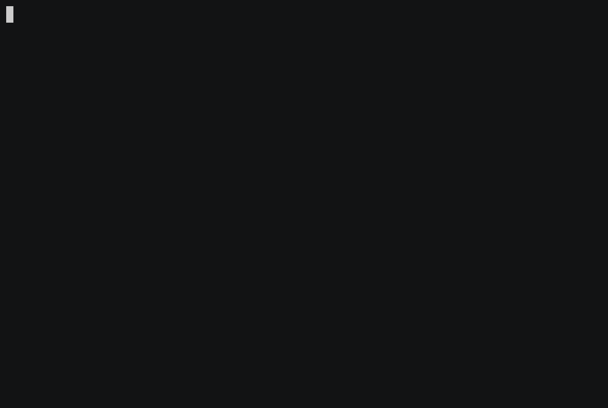

# RXV RISC-V soft core.

© Jamie Iles 2019-2026

The RXV core is an RV32IMAZicsrZifencei core written in SystemVerilog offering
good performance and synthesizable for a variety of FPGAs.  Additional
standard extensions include:

  - SSTC (supervisor timer compare)
  - Sscofpmf (supervisor PMU + filter)
  - Zicbom (cache-block management), CBO.CLEAN, CBO.FLUSH and CBO.INVAL all
    write back the line if dirty and then invalidate it, menvcfg/senvcfg
    CBCFE/CBIE only control whether the instructions trap

The core is capable of running mainline Linux with a user-space compiled for rv32ima.
## Performance

2.61 CoreMark/MHz (32KB 8-way I+D cache, 2 cycle memory latency) and can be
synthesized to ~100MHz for Intel Cyclone V or Xilinx Spartan 7.

## Microarchitecture

  - 7 stage pipeline
    - Fetch 1: next PC generation, combined BTB/PHT lookup
    - Fetch 2: instruction cache tag lookup, instruction TLB lookup, branch
      prediction resteer
    - Fetch 2: tag compare, prefetch queue write
    - Decode: instruction decode, register rename, misidentified branch resteer
      and issue.  All instructions apart from atomic fetch/op/store are a single
      uop, atomic operations may require more than one uop
    - Execute: execute in one of 4 functional units:
      - LSU: fully pipelined, a dependent instruction can issue 3 cycles after
        a load with the result forwarded before writeback.  Misaligned load/store
        exceptions are raised in the first cycle, invalid AMO (atomic to device
        memory) and page faults are handled in the second cycle
      - Integer: integer operations, branches, CSR accesses, 1 cycle latency
        with result forwarding back to input.  Illegal instruction, branch
        alignment and environment call exceptions are raised here
      - Multiply: fully pipelined, a dependent instruction can issue 4 cycles
        after a MUL and 5 cycles after a MULH/MULHSU/MULHU with the result
        forwarded before writeback
      - Divide: non-pipelined 33 cycle result-use latency
    - Writeback: results are written back to the register file
    - Commit: rename file updated and exceptions raised

Instructions may write back out of order but can be unwound in a single on
exception and are committed in-order.

TLB/cache misses or accesses to device-memory cause newer instructions to be
killed and reissued once the LSU is no longer busy to prevent architecturally
visible accesses from starting in the shadow of an exception.

## Performance Counters

There are a configurable number of performance counters in addition to the
mcycle+minstret fixed counters which can be used for profiling:

    - PMU_CYCLES
    - PMU_INSTRET
    - PMU_BRANCH
    - PMU_BRANCH_MISPRED
    - PMU_FE_STALL
    - PMU_BE_STALL
    - PMU_L1D_READ
    - PMU_L1D_READ_MISS
    - PMU_L1D_WRITE
    - PMU_L1D_WRITE_MISS
    - PMU_L1I_READ
    - PMU_L1I_READ_MISS
    - PMU_DTLB_READ
    - PMU_DTLB_READ_MISS
    - PMU_ITLB_READ
    - PMU_ITLB_READ_MISS

## Extensions

Model specific CSRs are:

  - 0x05C0: STPVAL - physical address associated with an access/page fault
  - 0x05C1: STPERMS - permissions associated with an access/page fault:
    - [8] page walk PMP access violation
    - [7] page executable
    - [6] page writable
    - [5] page readable
    - [4] page user accessible
    - [3] page global
    - [2] PMP executable
    - [1] PMP writable
    - [0] PMP readable

## Simulator

The simulator (rxv-simulator) includes a software ISA simulation as a reference
and can be switched with a command line option to use a Verilated RTL model that
will run at ~800KHz on an Intel Core i7-1185G7.  The simulator includes a
rudimentary model of a 16550A UART without interrupts so is sufficient to boot a
Linux kernel and preloaded ramdisk.  OpenSBI is used as the SBI implementation
and uses the generic platform so does not require any additional patches.

    Options:
    --elf arg             ELF file
    --binary arg          Extra binary file(s)
    --sim arg             Simulator
    --waves arg           Waves File
    --trace_file arg      TraceName
    --uart_log arg        UART log path
    --trigger-start arg   Trigger wave capture at cycle count N
    --trigger-end arg     Trigger wave capture at cycle count N
    --compliance          Run compliance test
    -h [ --help ]         Help screen

For example:

    ./simulator/rxv-simulator --simulator rtl \
        --binary fw_jump.bin@0x84000000 \
        --binary linux/arch/riscv/boot/Image@0x84400000 \
        --binary platform/rxv-emul.dtb@0x80200000 \
        --binary rootfs.img@0x88000000 \
	--elf simulator/bootrom/sim-bootrom

will load the OpenSBI ELF file and then copy the Linux kernel and root
filesystem to 0x84400000 and 0x88000000 respectively before setting the PC to
the entry point of OpenSBI.

Tracing can be enabled with --trace to write to a binary trace file which will
include all memory accesses, instructions executed, register writes, CSR writes,
privilege level, timestamp and address translations.  These can later be decoded
with the trace-decode tool:

    [devuser@304a84fde480 _build]$ ./tools/trace-decode --m-elf fw_jump.elf --s-elf linux/vmlinux kernel.trace --last 500 | tail -20
    @ 7339264    S c055c398  lw s5, 36(sp)                   # [instr: 02412a83, pa: 8095c398] memblock_alloc_range_nid+0x150
                             s5  := 00000000
                             R32 M[c0681ec4] == 00000000     # [v2p(c0681ec4) == 80a81ec4]
    @ 7339265    S c055c39c  lw s6, 32(sp)                   # [instr: 02012b03, pa: 8095c39c] memblock_alloc_range_nid+0x154
                             s6  := 00000000
                             R32 M[c0681ec0] == 00000000     # [v2p(c0681ec0) == 80a81ec0]
    @ 7339266    S c055c3a0  lw s7, 28(sp)                   # [instr: 01c12b83, pa: 8095c3a0] memblock_alloc_range_nid+0x158
                             s7  := 00000000
                             R32 M[c0681ebc] == 00000000     # [v2p(c0681ebc) == 80a81ebc]
    @ 7339267    S c055c3a4  lw s8, 24(sp)                   # [instr: 01812c03, pa: 8095c3a4] memblock_alloc_range_nid+0x15c
                             s8  := 00000008
                             R32 M[c0681eb8] == 00000008     # [v2p(c0681eb8) == 80a81eb8]
    @ 7339268    S c055c3a8  lw s9, 20(sp)                   # [instr: 01412c83, pa: 8095c3a8] memblock_alloc_range_nid+0x160
                             s9  := 80030950
                             R32 M[c0681eb4] == 80030950     # [v2p(c0681eb4) == 80a81eb4]
    @ 7339269    S c055c3ac  mv a0, s1                       # [instr: 00048513, pa: 8095c3ac] memblock_alloc_range_nid+0x164
                             a0  := 87ee7200
    @ 7339270    S c055c3b0  lw s1, 52(sp)                   # [instr: 03412483, pa: 8095c3b0] memblock_alloc_range_nid+0x168
                             s1  := 00000100
                             R32 M[c0681ed4] == 00000100     # [v2p(c0681ed4) == 80a81ed4]

shows the instructions being executed, disassembly, ELF symbol names and offsets
and translations.  This tracing runs with relatively low overhead.

Finally, an ELF core file can be generated from the trace allowing a high-level
view of the system state.  This is created by replaying the trace which is much
quicker than the simulation run and can recreate memory + architectural state
making it easy to read strings, obtain a backtrace and traverse data structures
with debug symbols.  The core file can be generated for any cycle count in the
history of the trace and will correctly translate virtual addresses.

    devuser@304a84fde480 _build]$ ./tools/make-core kernel.trace kernel.core
    [devuser@304a84fde480 _build]$ gdb-multiarch -q linux/vmlinux -ex 'core kernel.core' -ex 'bt'
    Reading symbols from linux/vmlinux...
    [New process 1]
    #0  0xc055c3b0 in memblock_alloc_range_nid (size=<optimized out>, size@entry=256, align=<optimized out>, align@entry=64, start=start@entry=0, end=end@entry=0, nid=<optimized out>, nid@entry=-1, exact_nid=exact_nid@entry=false) at /home/jamie/src/linux/mm/memblock.c:1409
    1409    }
    #0  0xc055c3b0 in memblock_alloc_range_nid (size=<optimized out>, size@entry=256, align=<optimized out>, align@entry=64, start=start@entry=0, end=end@entry=0, nid=<optimized out>, nid@entry=-1, exact_nid=exact_nid@entry=false) at /home/jamie/src/linux/mm/memblock.c:1409
    #1  0xc055c454 in memblock_alloc_internal (size=size@entry=256, align=align@entry=64, min_addr=0, max_addr=0, nid=nid@entry=-1, exact_nid=exact_nid@entry=false) at /home/jamie/src/linux/mm/memblock.c:1492
    #2  0xc055c770 in memblock_alloc_try_nid (size=size@entry=256, align=align@entry=64, min_addr=<optimized out>, min_addr@entry=0, max_addr=<optimized out>, max_addr@entry=0, nid=nid@entry=-1) at /home/jamie/src/linux/mm/memblock.c:1596
    #3  0xc055926c in memblock_alloc (align=64, size=256) at /home/jamie/src/linux/include/linux/memblock.h:426
    #4  pcpu_alloc_first_chunk (tmp_addr=tmp_addr@entry=3350061056, map_size=32768) at /home/jamie/src/linux/mm/percpu.c:1393
    #5  0xc0559bc8 in pcpu_setup_first_chunk (ai=ai@entry=0xc7ae6000, base_addr=0xc7ade000) at /home/jamie/src/linux/mm/percpu.c:2754
    #6  0xc0559d18 in setup_per_cpu_areas () at /home/jamie/src/linux/mm/percpu.c:3428
    #7  0xc054d4d8 in start_kernel () at /home/jamie/src/linux/init/main.c:955
    #8  0xc000015c in _start_kernel () at /home/jamie/src/linux/arch/riscv/kernel/head.S:324
    Backtrace stopped: frame did not save the PC
    (gdb)

## Building

Building OpenSBI:

    make PLATFORM_RISCV_XLEN=32 \
        PLATFORM_RISCV_ISA=rv32ima_zicsr_zifencei \
        CROSS_COMPILE=riscv64-linux-gnu- PLATFORM=generic

Building the simulator and tests:

    mkdir _build && cd _build
    cmake -GNinja -DCMAKE_BUILD_TYPE=RelWithDebInfo ..
    ninja
    ctest

Which will run all unit tests, RISC-V compliance tests, RISC-V ISA tests and a
number of formal tests.

A Linux kernel [defconfig](platform/linux-defconfig) has all required features
for running on the Arty S7 board, and [this
patch](https://github.com/jamieiles/linux/commit/143f9f538135473c4303af4be13223a053879ae9)
should be applied to the kernel source to enable the Xilinx interrupt controller
for RISC-V platforms.

## FPGA

To build an FPGA image for the Arty S7 (tested with Vivado 2021.2):

    cd _build/fpga/xilinx
    vivado -mode tcl -source ../../../fpga/xilinx/rxv-arty.tcl
    vivado -mode tcl -source ../../../fpga/xilinx/program.tcl

and optionally use flash.tcl to program the configuration memory on the board.
The bootrom will look for a bootable FAT16 filesystem on the SD card (<32MB)
with OPENSBI.BIN containing the fw_jump.bin from the OpenSBI build and the Linux
kernel (arch/riscv/boot/Image) as IMAGE.BIN.  The second partition on the SD
card should be an ext4 filesystem with an rv32ima Linux installation.  The micro
SD PMOD should be installed in connector JC.

The default Arty S7 configuration has:

  - RXV Core
    - 32KB 8-way set associated instruction cache
    - 32KB 8-way set associated data cache
    - 16-way fully associated instruction TLB
    - 16-way fully associated data TLB
    - MTIME reference at ~10MHz
    - Separate AXI4 instruction+data busses
  - Xilinx AXI interrupt controller
  - Xilinx AXI 16550A UART
  - Xilinx AXI SPI master with 1 chip select and 256 byte FIFO
  - SDHCI 2.00 compatible SD host controller with SDMA, the DMA goes into DRAM
    through the MIG frontend and is not coherent with the CPU caches
  - Xilinx AXI4 SmartConnect
  - Xilinx AXI memory adapter connecting to the BootROM

The Arty [Device Tree](platform/rxv-arty.dts) has the memory map for these components.

### Terasic DE0-CV

The DE0-CV (Cyclone V 5CEBA4F23C7) port has a VGA framebuffer console and PS/2
keyboard and mouse instead of a serial port, and no networking.  The boot ROM
is built in the container with the rest of the tree, then the bitstream is
built with Quartus Prime Lite (tested with 25.1std) from an empty directory:

    mkdir -p _build/fpga/intel/de0-cv/hw && cd _build/fpga/intel/de0-cv/hw
    quartus_sh -t ../../../../../fpga/intel/de0-cv/de0cv.tcl
    quartus_pgm -m JTAG -o "p;DE0CVTop.sof"

There is no serial port, so the console UART at 0xffff1000 keeps what is
written to it in an 8KB buffer read over JTAG; OpenSBI needs a console and
the kernel logs to it as well as the framebuffer:

    quartus_stp -t fpga/intel/de0-cv/jtag-console.tcl [follow]

and `debug-probe.tcl` samples the core's PC, privilege level, mcause, mepc,
mtval and last call site for when it hangs.

The boot ROM shows its progress on the VGA output and loads OPENSBI.BIN,
IMAGEGZ.BIN (the gzipped kernel Image, optional) and DE0CV.DTB from a bootable
FAT16 first partition on the microSD card, the second partition is the root
filesystem.  The kernel is configured with [linux-defconfig](platform/linux-defconfig)
merged with [linux-de0cv.config](platform/linux-de0cv.config) and needs no
patches, the [Device Tree](platform/rxv-de0cv.dts) has the memory map.  The
PS/2 keyboard is on the first port of the connector and the mouse on the
second, through a Y cable.

The DE0-CV configuration has:

  - RXV Core at 60MHz with the same caches and TLBs as the Arty
  - 64MB SDR SDRAM with a burst length 1 controller, the top 1MB is the
    framebuffer, also mapped uncached at 0xf8000000
  - 640x480 RGB565 VGA scanout from the framebuffer to the 4-bit DAC,
    described to Linux as a simple-framebuffer
  - RISC-V PLIC
  - SDHCI 2.00 compatible SD host controller with SDMA, as on the Arty
  - Two PS/2 ports compatible with the Altera University Program PS/2 core
  - Console UART read over JTAG, and LEDs and seven segment displays for debug
  - 32KB dual port boot ROM

`TestDE0CVSoC` and `TestDE0CVBoot` in the RTL unit tests run the whole system
in simulation, the latter booting from a simulated SD card (set DE0CV_FB_DUMP
to a file name to save the screen as a PPM).
